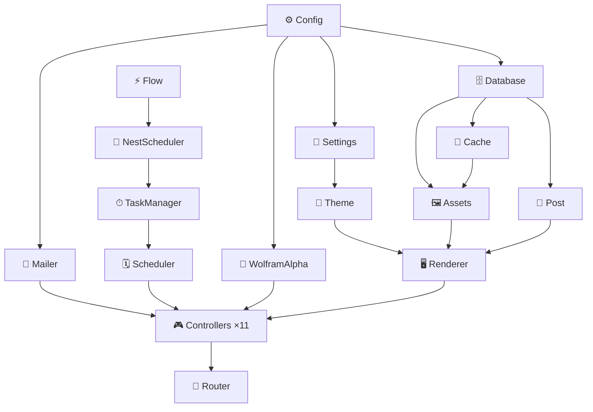

# PersonalSite

[](https://www.wolfram.com/language/)
[]()
[]()
[](LICENSE)

Sitio personal servido con **Wolfram Language** vía Wolfram Web Engine.  
Incluye blog, integración con Wolfram|Alpha, runtime scheduler con TaskObjects, NestGraph paralelo y dashboard de tareas.

---

## Módulos del paclet



> Orden de carga garantizado por `Kernel/init.wl`.  
> Cada módulo usa `BeginPackage`/`EndPackage` con contexto propio.

---

## Release — `.paclet`

### Estructura del artifact

```
build/
└── alpha-1.0.1.paclet        ← ZIP (196 KB) listo para PacletInstall
    └── PersonalSite/
        ├── PacletInfo.wl     ← versión + extensiones declaradas
        ├── Kernel/           ← código WL (Config, Models, Controllers, Router)
        └── Resources/        ← CSS compilado, Templates HTML, Img
```

> `deploy/` y `data/` **no** se incluyen — son artefactos de Docker, no parte del paclet.

### Construir el paclet

```bash
# Compila SCSS → CSS y empaqueta → build/alpha-1.0.1.paclet
make paclet

# Canal personalizado
make paclet CHANNEL=beta
make paclet CHANNEL=release OUT=dist

# Limpiar build/
make paclet-clean

# O directamente con Python
python3 tools/build_paclet.py --channel alpha
```

### Instalar y cargar

```wolfram
(* Instalar desde archivo local *)
PacletInstall["/ruta/al/build/alpha-1.0.1.paclet"]
Needs["PersonalSite`"]
```

```wolfram
(* Verificar versión instalada *)
PacletObject["PersonalSite"]["Version"]   (* → "1.0.1" *)
```

---

## Probar el Scheduler y TaskManager

### Opción A — Contra el servidor en ejecución (más rápida)

El servidor en `http://localhost:8080` ya tiene el `TaskManager` cargado
con las 6 tareas del sistema corriendo.

```bash
# Snapshot completo del runtime
curl -s http://localhost:8080/tasks/summary | python3 -m json.tool

# Grafo DAG de dependencias entre tareas
curl -s http://localhost:8080/tasks/dag | python3 -m json.tool

# Historial de ejecución de heartbeat
curl -s http://localhost:8080/tasks/history/heartbeat | python3 -m json.tool

# Registrar una tarea nueva en caliente
curl -s -X POST http://localhost:8080/tasks/register \
  -d "id=test-cli&label=CLI+Test&group=user&interval=10&actionCode=Function[42]&enabled=true" \
  | python3 -m json.tool

# Detener una tarea
curl -s -X POST http://localhost:8080/tasks/stop/test-cli | python3 -m json.tool

# Eliminar del registro
curl -s -X POST http://localhost:8080/tasks/unregister/test-cli | python3 -m json.tool
```

### Opción B — Suite de integración Python

```bash
# Corre los 10 bloques de tests contra localhost:8080
python3 tools/test_tasks.py
```

Cubre: dashboard HTML, summary JSON, stop/start lifecycle, restart,
historial, configure, register, **unregister**, **DAG**, smoke de rutas,
health del runtime (≥5 tareas running, 0 errores).

### Opción C — WolframScript interactivo (kernel propio)

```bash
docker exec -it profile-web-1 wolframscript
```

```wolfram
(* Cargar el paclet *)
PacletDirectoryLoad["/app"];
Needs["PersonalSite`"]

(* El Scheduler ya arrancó las 6 tareas del sistema *)
PersonalSite`TaskManager`summary[]

(* Registrar y arrancar una tarea de prueba *)
PersonalSite`TaskManager`register["test-cli",
  <|"label" -> "CLI Test", "group" -> "user",
    "interval" -> 5, "enabled" -> True,
    "deps" -> {}, "action" -> Function[42]|>]

PersonalSite`TaskManager`start["test-cli"]

(* Esperar un tick y ver historial *)
Pause[6]
PersonalSite`TaskManager`history["test-cli"]

(* Ver grafo DAG de dependencias *)
PersonalSite`TaskManager`dagData[]

(* Eliminar la tarea de prueba *)
PersonalSite`TaskManager`unregister["test-cli"]

(* Confirmar que desapareció *)
PersonalSite`TaskManager`info["test-cli"]    (* → $Failed *)
Keys @ PersonalSite`TaskManager`allTasks[]   (* → 6 tareas del sistema *)
```

### Tareas registradas por defecto

| ID | Grupo | Intervalo | Deps |
|----|-------|-----------|------|
| `heartbeat` | system | 30 s | — |
| `cache-warm` | system | 300 s | heartbeat |
| `theme-rotate` | theme | 10 s | heartbeat |
| `cards-refresh` | cache | 20 s | cache-warm |
| `metric-refresh` | cache | 300 s | cards-refresh |
| `nest-refresh` | flow | 300 s | cache-warm |

---

## Levantar el servidor

```bash
make up        # docker compose up -d  → http://localhost:8080
make logs      # logs en tiempo real
make down      # bajar
make shell     # bash en el contenedor
```

### Primera vez

```bash
make build        # construir imagen Docker
make seed         # inicializar SQLite
make load-db      # copiar DB al volumen Docker
make activate     # activar Wolfram Engine (una sola vez)
make up
```

---

## Formulario de contacto

La página `/contacto` envía cada mensaje por correo a `CONTACT_TO`
(por defecto `federicopfund@gmail.com`) usando SMTP.

Para activar el envío, exportá las credenciales en el host antes de levantar
el contenedor (con Gmail, generá una *App Password* en
https://myaccount.google.com/apppasswords):

```bash
export SMTP_USER="tucuenta@gmail.com"
export SMTP_PASSWORD="tu-app-password"   # 16 caracteres, sin espacios
# opcional: export SMTP_FROM="tucuenta@gmail.com"
make up
```

Variables disponibles (ver `docker-compose.yml`):

| Variable        | Default                     | Descripción                          |
| --------------- | --------------------------- | ------------------------------------ |
| `CONTACT_TO`    | `federicopfund@gmail.com`   | Destinatario de los mensajes         |
| `SMTP_SERVER`   | `smtp.gmail.com`            | Host SMTP                            |
| `SMTP_PORT`     | `587`                       | Puerto (STARTTLS)                    |
| `SMTP_USER`     | *(vacío)*                   | Usuario SMTP (secreto)              |
| `SMTP_PASSWORD` | *(vacío)*                   | Contraseña / app-password (secreto) |
| `SMTP_FROM`     | `SMTP_USER`                 | Dirección remitente                 |

Si `SMTP_USER`/`SMTP_PASSWORD` no están definidos, el formulario sigue
visible pero informa que el envío no está configurado (sin romper el sitio).

