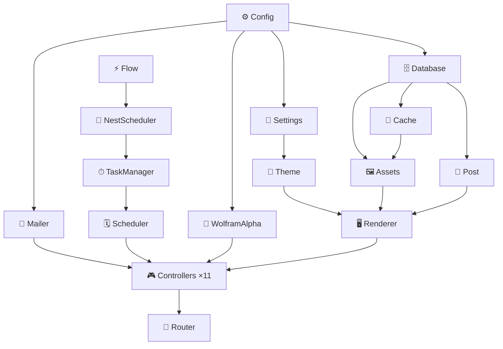
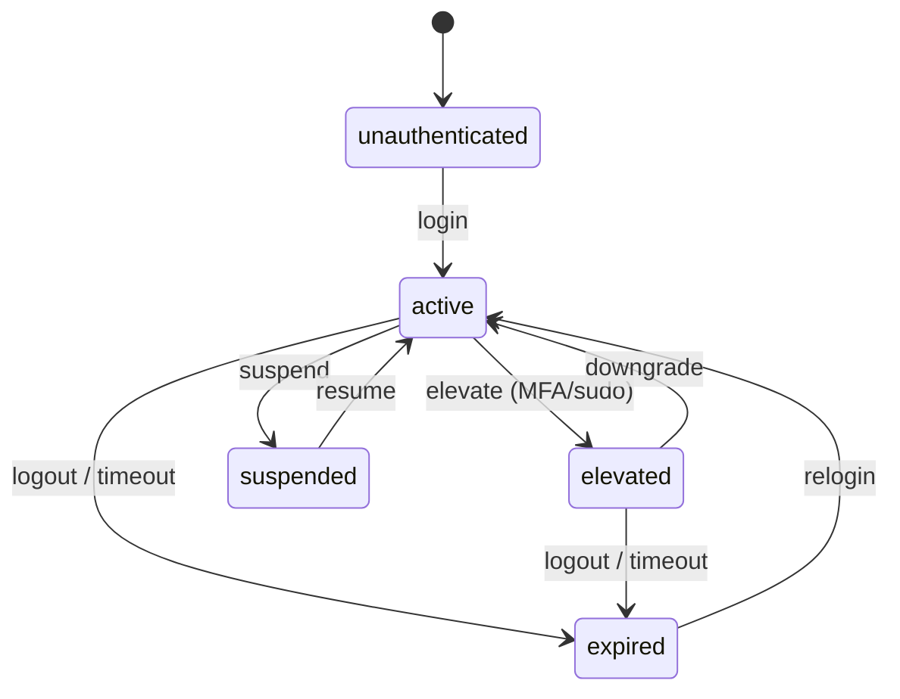

# PersonalSite

[](https://www.wolfram.com/language/)
[]()
[]()
[](LICENSE)

Sitio personal servido con **Wolfram Language** vía Wolfram Web Engine.  
Incluye blog, integración con Wolfram|Alpha, runtime scheduler con TaskObjects, NestGraph paralelo y dashboard de tareas.

---

## Módulos del paclet



> Orden de carga garantizado por `Kernel/init.wl`.  
> Cada módulo usa `BeginPackage`/`EndPackage` con contexto propio.

---

## Release — `.paclet`

### Estructura del artifact

```
build/
└── alpha-1.0.1.paclet        ← ZIP (196 KB) listo para PacletInstall
    └── PersonalSite/
        ├── PacletInfo.wl     ← versión + extensiones declaradas
        ├── Kernel/           ← código WL (Config, Models, Controllers, Router)
        └── Resources/        ← CSS compilado, Templates HTML, Img
```

> `deploy/` y `data/` **no** se incluyen — son artefactos de Docker, no parte del paclet.

### Construir el paclet

```bash
# Compila SCSS → CSS y empaqueta → build/alpha-1.0.1.paclet
make paclet

# Canal personalizado
make paclet CHANNEL=beta
make paclet CHANNEL=release OUT=dist

# Limpiar build/
make paclet-clean

# O directamente con Python
python3 tools/build_paclet.py --channel alpha
```

### Instalar y cargar

```wolfram
(* Instalar desde archivo local *)
PacletInstall["/ruta/al/build/alpha-1.0.1.paclet"]
Needs["PersonalSite`"]
```

```wolfram
(* Verificar versión instalada *)
PacletObject["PersonalSite"]["Version"]   (* → "1.0.1" *)
```

---

## Probar el Scheduler y TaskManager

### Opción A — Contra el servidor en ejecución (más rápida)

El servidor en `http://localhost:8080` ya tiene el `TaskManager` cargado
con las 6 tareas del sistema corriendo.

```bash
# Snapshot completo del runtime
curl -s http://localhost:8080/tasks/summary | python3 -m json.tool

# Grafo DAG de dependencias entre tareas
curl -s http://localhost:8080/tasks/dag | python3 -m json.tool

# Historial de ejecución de heartbeat
curl -s http://localhost:8080/tasks/history/heartbeat | python3 -m json.tool

# Registrar una tarea nueva en caliente
curl -s -X POST http://localhost:8080/tasks/register \
  -d "id=test-cli&label=CLI+Test&group=user&interval=10&actionCode=Function[42]&enabled=true" \
  | python3 -m json.tool

# Detener una tarea
curl -s -X POST http://localhost:8080/tasks/stop/test-cli | python3 -m json.tool

# Eliminar del registro
curl -s -X POST http://localhost:8080/tasks/unregister/test-cli | python3 -m json.tool
```

### Opción B — Suite de integración Python

```bash
# Corre los 10 bloques de tests contra localhost:8080
python3 tools/test_tasks.py
```

Cubre: dashboard HTML, summary JSON, stop/start lifecycle, restart,
historial, configure, register, **unregister**, **DAG**, smoke de rutas,
health del runtime (≥5 tareas running, 0 errores).

### Opción C — WolframScript interactivo (kernel propio)

```bash
docker exec -it profile-web-1 wolframscript
```

```wolfram
(* Cargar el paclet *)
PacletDirectoryLoad["/app"];
Needs["PersonalSite`"]

(* El Scheduler ya arrancó las 6 tareas del sistema *)
PersonalSite`TaskManager`summary[]

(* Registrar y arrancar una tarea de prueba *)
PersonalSite`TaskManager`register["test-cli",
  <|"label" -> "CLI Test", "group" -> "user",
    "interval" -> 5, "enabled" -> True,
    "deps" -> {}, "action" -> Function[42]|>]

PersonalSite`TaskManager`start["test-cli"]

(* Esperar un tick y ver historial *)
Pause[6]
PersonalSite`TaskManager`history["test-cli"]

(* Ver grafo DAG de dependencias *)
PersonalSite`TaskManager`dagData[]

(* Eliminar la tarea de prueba *)
PersonalSite`TaskManager`unregister["test-cli"]

(* Confirmar que desapareció *)
PersonalSite`TaskManager`info["test-cli"]    (* → $Failed *)
Keys @ PersonalSite`TaskManager`allTasks[]   (* → 6 tareas del sistema *)
```

### Tareas registradas por defecto

| ID | Grupo | Intervalo | Deps |
|----|-------|-----------|------|
| `heartbeat` | system | 30 s | — |
| `cache-warm` | system | 300 s | heartbeat |
| `theme-rotate` | theme | 10 s | heartbeat |
| `cards-refresh` | cache | 20 s | cache-warm |
| `metric-refresh` | cache | 300 s | cards-refresh |
| `nest-refresh` | flow | 300 s | cache-warm |

---

## Sesiones — NestGraph Permission FSM

El sistema de sesiones modela los permisos como un **NestGraph de profundidad 3**,
mapeando directamente el diagrama `NestGraph[{2#+1, #+14, #-18}&, {1}, 3]` del UI:

```
Seed      = contexto de autenticación base  <| role -> R, perms -> {} |>
Regla 1   = public.read    (role ≥ 1)   ← rama "2x+1"
Regla 2   = content.write  (role ≥ 2)   ← rama "x+14"
Regla 3   = kernel.eval    (role ≥ 3)   ← rama "x-18"
Depth = 3  →  40 nodos (1 + 3 + 9 + 27), igual al NestGraph del UI
```

### Ciclo de vida — FSM de estados



### Árbol de permisos por role

| Role | Permisos derivados (unión del NestGraph) |
|------|------------------------------------------|
| 1 | `public.read`, `blog.read`, `arch.view` |
| 2 | + `content.write`, `blog.write`, `tasks.view`, `nest.run`, `flow.run`, `contact.send` |
| 3 | + `kernel.eval`, `kernel.schedule`, `tasks.manage`, `admin.*`, `arch.data`, `ruliology.eval` |

### Endpoints de sesión

| Método | Ruta | Descripción |
|--------|------|-------------|
| `POST` | `/session/create` | Crea sesión; body `{"userId","role","meta"}` |
| `POST` | `/session/destroy` | Logout via Bearer token |
| `GET` | `/session/validate` | Valida token, devuelve estado |
| `GET` | `/session/info` | Sesión completa (requiere `public.read`) |
| `POST` | `/session/transition` | Aplica evento FSM: `elevate`, `suspend`, etc. |
| `GET` | `/session/graph` | Árbol NestGraph de permisos (40 nodos, JSON) |
| `GET` | `/session/fsm` | Grafo de transiciones FSM |
| `GET` | `/session/stats` | Métricas de sesiones activas |

### Probar el sistema de sesiones

#### Opción A — Suite de debug paso a paso (recomendada)

```bash
# 10 bloques explicados: token HMAC, árbol NestGraph, FSM, middleware, GC
python3 tools/test_sessions.py

# Con JSON completo en cada respuesta
python3 tools/test_sessions.py --verbose

# Contra otro servidor
python3 tools/test_sessions.py --base http://mi-servidor:8080
```

Cubre: anatomía del token HMAC-SHA256, validación, token corrupto → 401,
permisos por role, árbol NestGraph 40 nodos (L0/L1/L2/L3), transiciones FSM
válidas e inválidas, ciclo suspend/resume, middleware guard sin token → 401,
métricas Cache + DB, logout e invalidación post-destroy.

#### Opción B — curl contra el servidor en ejecución

```bash
BASE=http://localhost:8080

# 1. Crear sesión (role 2 = writer)
TOKEN=$(curl -s -X POST $BASE/session/create \
  -H "Content-Type: application/json" \
  -d '{"userId":"federico","role":2}' \
  | python3 -c "import sys,json; print(json.load(sys.stdin)['token'])")

echo "TOKEN: $TOKEN"

# 2. Validar token
curl -s $BASE/session/validate \
  -H "Authorization: Bearer $TOKEN" | python3 -m json.tool

# 3. Ver info completa + permisos
curl -s $BASE/session/info \
  -H "Authorization: Bearer $TOKEN" | python3 -m json.tool

# 4. Elevar privilegios (active → elevated)
curl -s -X POST $BASE/session/transition \
  -H "Authorization: Bearer $TOKEN" \
  -H "Content-Type: application/json" \
  -d '{"event":"elevate"}' | python3 -m json.tool

# 5. Ver árbol NestGraph de permisos (role 2, 40 nodos)
curl -s "$BASE/session/graph" \
  -H "Authorization: Bearer $TOKEN" | python3 -m json.tool

# 6. Ver grafo FSM de transiciones
curl -s $BASE/session/fsm | python3 -m json.tool

# 7. Métricas
curl -s $BASE/session/stats | python3 -m json.tool

# 8. Cerrar sesión
curl -s -X POST $BASE/session/destroy \
  -H "Authorization: Bearer $TOKEN" | python3 -m json.tool

# 9. Confirmar invalidación (debe devolver 401)
curl -s $BASE/session/validate \
  -H "Authorization: Bearer $TOKEN" | python3 -m json.tool
```

#### Opción B — WolframScript interactivo

```bash
docker exec -it profile-web-1 wolframscript
```

```wolfram
PacletDirectoryLoad["/app"];
Needs["PersonalSite`"]

(* Crear sesión role=3 (admin) *)
result = PersonalSite`SessionStore`createSession["federico", 3, <|"origin"->"wolframscript"|>]
token  = result["token"]

(* Validar y ver permisos derivados del NestGraph *)
session = PersonalSite`SessionStore`validateToken[token]
session["permissions"]    (* 40-node tree collapsed to union *)

(* Árbol completo (40 nodos, depth=3, 3 reglas) *)
PersonalSite`SessionFSM`permissionTree[3]

(* Verificar capability *)
PersonalSite`SessionFSM`can[session, "kernel.eval"]   (* True *)
PersonalSite`SessionFSM`can[session, "admin.*"]        (* True *)

(* FSM: elevar a elevated *)
{newSession, status} = PersonalSite`SessionStore`applyTransition[
  session["sessionId"], "elevate"]
newSession["state"]   (* "elevated" *)

(* FSM: bajar de nuevo *)
{s2, _} = PersonalSite`SessionStore`applyTransition[
  session["sessionId"], "downgrade"]
s2["state"]   (* "active" *)

(* Transición inválida: debe fallar *)
{bad, reason} = PersonalSite`SessionStore`applyTransition[
  session["sessionId"], "resume"]   (* suspended->active, pero estado es active *)
bad    (* $Failed *)
reason (* "invalid_transition:active->resume" *)

(* Grafo de transiciones FSM como JSON *)
PersonalSite`SessionFSM`fsmGraph[]

(* Métricas *)
PersonalSite`SessionStore`sessionStats[]

(* GC: purgar expiradas *)
PersonalSite`SessionStore`gcSessions[]

(* Destruir sesión *)
PersonalSite`SessionStore`destroySession[session["sessionId"]]

(* Confirmar invalidación *)
PersonalSite`SessionStore`validateToken[token]   (* $Failed *)
```

#### Opción C — WLT tests con `TestReport.wl` (paclet)

Tests formales en Wolfram Language organizados por **layer** de módulos.
Cada suite corre con `TestReport` nativo y reporta `pass / total` por archivo.

```bash
# Todos los módulos (193 tests)
docker exec profile-web-1 wolframscript -script /app/PersonalSite/Tests/TestReport.wl

# Solo la capa de sesiones: SessionFSM + SessionStore (106 tests)
docker exec profile-web-1 wolframscript -script /app/PersonalSite/Tests/TestReport.wl -- --layer session

# Solo la capa de flujo: Flow + NestScheduler (65 tests)
docker exec profile-web-1 wolframscript -script /app/PersonalSite/Tests/TestReport.wl -- --layer flow

# Solo base de datos: Database (22 tests)
docker exec profile-web-1 wolframscript -script /app/PersonalSite/Tests/TestReport.wl -- --layer db

# Flow + NestScheduler + Database (87 tests)
docker exec profile-web-1 wolframscript -script /app/PersonalSite/Tests/TestReport.wl -- --layer models

# Formato alternativo con signo igual
docker exec profile-web-1 wolframscript -script /app/PersonalSite/Tests/TestReport.wl -- --layer=session
```

**Layers disponibles:**

| `--layer` | Suites | Tests |
|-----------|--------|------:|
| `all` *(default)* | SessionFSM, SessionStore, Flow, NestScheduler, Database | 193 |
| `session` | SessionFSM, SessionStore | 106 |
| `flow` | Flow, NestScheduler | 65 |
| `models` | Flow, NestScheduler, Database | 87 |
| `db` | Database | 22 |

**Archivos de tests:**

| Archivo | Tipo | Descripción |
|---------|------|-------------|
| `Tests/SessionFSM.wlt` | Pure WL | `derivePermissions`, `permissionTree`, `transition`, `can`, `fsmGraph` |
| `Tests/SessionStore.wlt` | Integración DB | `createSession`, `validateToken`, `applyTransition`, `refreshSession`, `destroySession`, GC |
| `Tests/Flow.wlt` | Pure WL | `edges`, `acyclicQ`, `layers`, `run` con backends sync/session/parallel |
| `Tests/NestScheduler.wlt` | Pure WL | `build`, `records` por nivel, `run`, `export` CSV/JSON |
| `Tests/Database.wlt` | Integración SQLite | `setup`, `diag`, `execute`, CRUD, datos de seed |

#### Variables de entorno de sesión

| Variable | Default | Descripción |
|----------|---------|-------------|
| `SESSION_SECRET` | *(generado por proceso en dev)* | Secreto HMAC-SHA256 — **debe ser fijo en producción**. Si no se define, el secreto se genera una sola vez al arrancar el kernel (válido solo en dev) |
| `SESSION_TTL` | `3600` | Duración de sesión en segundos |

> **Producción**: exportar `SESSION_SECRET` con mínimo 32 caracteres de entropía antes de levantar el contenedor.

---

## Levantar el servidor

```bash
make up        # docker compose up -d  → http://localhost:8080
make logs      # logs en tiempo real
make down      # bajar
make shell     # bash en el contenedor
```

### Primera vez

```bash
make build        # construir imagen Docker
make seed         # inicializar SQLite
make load-db      # copiar DB al volumen Docker
make activate     # activar Wolfram Engine (una sola vez)
make up
```

---

## Formulario de contacto

La página `/contacto` envía cada mensaje por correo a `CONTACT_TO`
(por defecto `federicopfund@gmail.com`) usando SMTP.

Para activar el envío, exportá las credenciales en el host antes de levantar
el contenedor (con Gmail, generá una *App Password* en
https://myaccount.google.com/apppasswords):

```bash
export SMTP_USER="tucuenta@gmail.com"
export SMTP_PASSWORD="tu-app-password"   # 16 caracteres, sin espacios
# opcional: export SMTP_FROM="tucuenta@gmail.com"
make up
```

Variables disponibles (ver `docker-compose.yml`):

| Variable        | Default                     | Descripción                          |
| --------------- | --------------------------- | ------------------------------------ |
| `CONTACT_TO`    | `federicopfund@gmail.com`   | Destinatario de los mensajes         |
| `SMTP_SERVER`   | `smtp.gmail.com`            | Host SMTP                            |
| `SMTP_PORT`     | `587`                       | Puerto (STARTTLS)                    |
| `SMTP_USER`     | *(vacío)*                   | Usuario SMTP (secreto)              |
| `SMTP_PASSWORD` | *(vacío)*                   | Contraseña / app-password (secreto) |
| `SMTP_FROM`     | `SMTP_USER`                 | Dirección remitente                 |

Si `SMTP_USER`/`SMTP_PASSWORD` no están definidos, el formulario sigue
visible pero informa que el envío no está configurado (sin romper el sitio).

